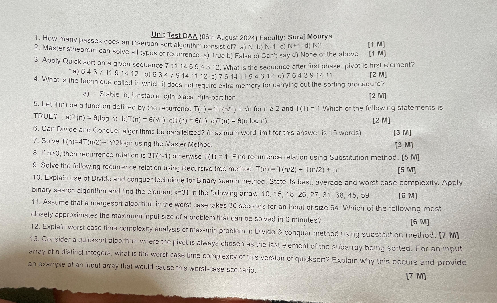
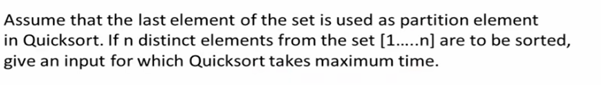
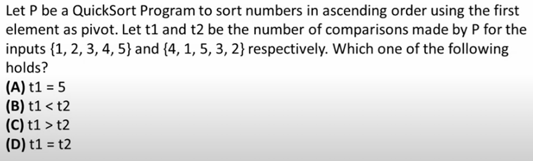

***
#### IMP. Questions 

***

1.

### The problem is asking for the input that will cause QuickSort to take the maximum time when the last element is always chosen as the pivot.

### Worst-Case Scenario in QuickSort:

When QuickSort always picks the last element as the pivot, the algorithm will take the maximum time if the array is already sorted in ascending or descending order. This is because, in such cases, the partitioning process results in one subarray being empty and the other containing all the remaining elements. This leads to a highly unbalanced partitioning, causing the recursion depth to be maximum, which is \( n \) (where \( n \) is the number of elements).

### Maximum Time Input:
- If the array is sorted in **ascending order**, and QuickSort always chooses the last element as the pivot, the algorithm will make \( n-1 \) comparisons in the first partition, \( n-2 \) in the second partition, and so on. This results in \( O(n^2) \) time complexity.

### Example Input for Maximum Time:
- The input array in **ascending order**: \([1, 2, 3, . . ., n]\) 
- Or in **descending order**: \([n, n-1, n-2, . . ., 1]\).

So, either \([1, 2, 3, . . . , n]\) or \([n, n-1, n-2, . . . , 1]\) will cause QuickSort to take the maximum time when the last element is used as the pivot.

---

2.



Let's break down the question.

We need to compare the number of comparisons made by QuickSort when using the first element as the pivot for two different inputs:

1. **Input 1: `{1, 2, 3, 4, 5}`**
2. **Input 2: `{4, 1, 5, 3, 2}`**

### Analysis:

#### Input 1: `{1, 2, 3, 4, 5}`
- The array is already sorted in ascending order.
- QuickSort will pick the first element (`1`) as the pivot, which is already the smallest element.
- The remaining elements (`2, 3, 4, 5`) will form the right subarray.
- This process will be repeated, so QuickSort will keep choosing the smallest remaining element as the pivot.

  Number of comparisons:
  - 4 comparisons for first pass (pivot = 1)
  - 3 comparisons for second pass (pivot = 2)
  - 2 comparisons for third pass (pivot = 3)
  - 1 comparison for fourth pass (pivot = 4)
  
  Total = 4 + 3 + 2 + 1 = **10** comparisons.

#### Input 2: `{4, 1, 5, 3, 2}`
- The array is not sorted.
- QuickSort picks the first element (`4`) as the pivot.
- After partitioning, it will split into `{1, 3, 2}` and `{5}`.
- Then, it continues sorting the subarrays.

  Number of comparisons:
  - For the first partition, 4 comparisons (pivot = 4)
  - For the second partition of `{1, 3, 2}`, 3 comparisons (pivot = 1)
  - For the next partition of `{3, 2}`, 2 comparisons (pivot = 3)
  - Finally, 1 comparison for the last element.
  
  Total = 4 + 3 + 2 + 1 = **10** comparisons.

### Conclusion:
- Both inputs result in the same number of comparisons, \( t1 = t2 = 10 \).

Thus, the correct answer is:

**(D) t1 = t2**.


---
3.
## Greedy Algorithm :
- A Greedy algorithm is a problem-solving technique that builds up a solution piece by piece, always choosing the next piece that offers the most immediate benefit.

- The idea behind a greedy algorithm is to make the optimal choice at each step which will lead to a globally optimal solution.

### Key Characteristics of Greedy Algorithms:
1. **Local Optimal Choice**: At each step, the algorithm makes the choice that seems best at the moment, without considering the global context.
2. **No Backtracking**: Once a choice is made, it is never reconsidered. This is in contrast to some other algorithms, like dynamic programming, which might reconsider and revise earlier decisions.
3. **Efficiency**: Greedy algorithms are often faster and simpler than other algorithms, but they don't always produce the optimal solution for every problem.

### When to Use a Greedy Algorithm:
Greedy algorithms are best used when the problem exhibits the **Greedy Choice Property** (a global optimum can be arrived at by selecting a local optimum) and **Optimal Substructure** (an optimal solution to the problem contains an optimal solution to subproblems).

### Examples of Greedy Algorithms:
1. **Coin Change Problem**: Given a set of coin denominations and a target amount, the greedy approach tries to make change by choosing the largest denomination available at each step.
   
2. **Huffman Coding**: Used for data compression, this algorithm builds a tree by repeatedly merging the two least frequent elements.

3. **Kruskal's and Prim's Algorithms**: These are used to find the minimum spanning tree in a graph. They build the tree by repeatedly adding the smallest weight edge that doesn’t form a cycle.

4. **Activity Selection Problem**: Given a set of activities, each with a start and end time, the goal is to select the maximum number of activities that don’t overlap. The greedy approach sorts activities by finish time and picks the earliest one available.

### Pros and Cons:
- **Pros**:
  - Simplicity and ease of implementation.
  - Often very fast because they make decisions in a single pass or a small number of passes.

- **Cons**:
  - Might not produce the optimal solution for all problems.
  - Requires careful problem analysis to ensure it applies correctly.

### Example: Fractional Knapsack Problem
Given a set of items with specific weights and values, and a knapsack with a capacity limit, the goal is to maximize the value of the items placed in the knapsack. The greedy approach here is to pick items with the highest value-to-weight ratio first until the knapsack is full.

In this case, the greedy algorithm will produce the optimal solution.

---
4.
### Huffman Coding?

Huffman coding is a popular algorithm used for data compression. The goal of Huffman coding is to reduce the size of data by encoding frequently occurring characters with shorter codes and less frequent characters with longer codes. It's a lossless compression technique, meaning that the original data can be perfectly reconstructed from the compressed data.

### How Does Huffman Coding Work?

The basic idea behind Huffman coding is to assign variable-length codes to characters, with shorter codes assigned to more frequent characters. The algorithm builds a binary tree called a **Huffman Tree** that helps generate these codes.

### Step-by-Step Huffman Coding Algorithm:

1. **Calculate Frequency of Characters**:
   - Count how many times each character appears in the data. This frequency will determine how important (or frequent) each character is.

2. **Build a Priority Queue**:
   - Create a priority queue (or a min-heap) where each node represents a character and its frequency. The queue is ordered so that the node with the smallest frequency is at the front.

3. **Build the Huffman Tree**:
   - While there is more than one node in the priority queue:
     1. Remove the two nodes with the lowest frequency from the queue.
     2. Create a new node with these two nodes as its children. The new node's frequency is the sum of the frequencies of the two nodes.
     3. Add the new node back into the priority queue.
   - The process continues until there is only one node left in the queue. This node is the root of the Huffman Tree.

4. **Assign Codes to Characters**:
   - Starting from the root of the Huffman Tree, assign binary codes to each character:
     - Traverse the tree to the left child: append `0` to the code.
     - Traverse the tree to the right child: append `1` to the code.
   - Continue this process until every leaf node (which represents a character) has a code.

5. **Encode the Data**:
   - Replace each character in the data with its corresponding Huffman code to produce the encoded data.

6. **Decode the Data**:
   - To decode the data, use the Huffman Tree to translate the binary code back into the original characters.

### Example of Huffman Coding:

Let's consider the following example data: `"aabbbcccc"`

1. **Calculate Frequency**:
   - `a`: 2 times
   - `b`: 3 times
   - `c`: 4 times

2. **Build a Priority Queue**:
   - Create nodes: `a(2)`, `b(3)`, `c(4)`.
   - The priority queue is: `a(2)`, `b(3)`, `c(4)`.

3. **Build the Huffman Tree**:
   - Combine `a(2)` and `b(3)` into a new node `ab(5)`.
   - The queue is now: `c(4)`, `ab(5)`.
   - Combine `c(4)` and `ab(5)` into a new node `cab(9)`.
   - The root of the tree is `cab(9)`.

4. **Assign Codes**:
   - `a`: `00`
   - `b`: `01`
   - `c`: `1`

5. **Encode the Data**:
   - Original data: `"aabbbcccc"`
   - Encoded data: `0000010101111111`

6. **Decode the Data**:
   - Use the Huffman Tree to convert `0000010101111111` back to `"aabbbcccc"`.

### Huffman Coding Algorithm in Pseudocode:

```plaintext
1. Calculate the frequency of each character in the input data.
2. Create a priority queue (min-heap) and insert all characters with their frequencies.
3. While there is more than one node in the priority queue:
   a. Remove the two nodes with the smallest frequency.
   b. Create a new internal node with these two nodes as children.
   c. Insert the new node back into the priority queue.
4. The remaining node in the priority queue is the root of the Huffman Tree.
5. Assign binary codes to each character by traversing the Huffman Tree:
   a. Traverse left, append '0' to the code.
   b. Traverse right, append '1' to the code.
6. Use the codes to encode the input data.
7. Decode the encoded data using the Huffman Tree.
```

---
